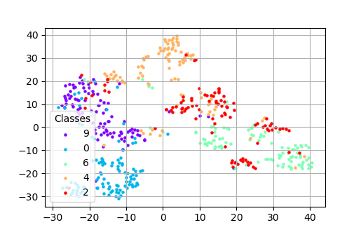

# SelfSupervised Document Classification
Leveraging Self-Supervised learning to classify document scans.

| SimCLR |
| :---: | 
|  |
\* *Figure is from its paper, SimCLR*

## What this script does
SimCLR is the simplest image-based self-supervised pretraining framework. It's not necessessarily the best, but is certainly elegant, easy to implement, and effective. This script investigates the how well the SimCLR algorithm performs on classifying document scans. 

Accuracy is judged using the linear classification protocol. This means that the SSL pre-training is done 100% without labels. After this, the backbone is frozen and a supervised linear classifier is trained. The accuracy with the linear classifier is what is reported. 

## Results:


SimCLR (with a resnet-18 backbone) performed well, with 82% overall accuracy. This compares well to a fully supervised ResNet-18 (89%):


T-SNE (t-Distributed Stochastic Neighbor Embedding) is a dimensionality reduction technique used for visualizing high-dimensional data in a lower-dimensional space. It is commonly used in machine learning and data analysis to explore complex datasets and discover patterns or relationships between data points. Conceptually, it is this embedded space that was the input to the linear classifier. 

The T-SNE visualization of SimCLR is shown below. The classes are fairly well clustered. This indicates that the embedded space is well differentated for downstream tasks. 



Open *SimCLR_0.0001LR_InteractiveTSNE.html* in a browser for an interactive T-sne.

## How to run:
The script was made to run locally on Apple M-series GPU/MPS, but will check and use CUDA if available. Will fall back to running on CPU (but it'll take forever). It's a significant speed-up running on MPS vs CPU. **To run on MPS, make sure your version of Pytorch supports this.** At the time of this writing, this was only available with the nightly version of Pytorch:

General pytorch install instructions:
https://pytorch.org/get-started/locally/

MacOS Pytorch Nightly install for MPS support:
```zsh
conda install pytorch torchvision torchaudio -c pytorch-nightly
```


## How to choose the dataset:

It's currently set up to train on the 5-class document scan dataset. If you want to use your own dataset, the "data" folder should be structered like this:

data/
- class_x
  - xxx.tif
  - xxy.tif
  - ...
  - xxz.tif
- class_y
  - 123.tif
  - nsdf3.tif
  - ...
  - asd932_.tif

In the case the data is unlabeled, use:

data/
- dataset_name
  - xxx.tif
  - xxy.tif
  - ...
  - xxz.tif

## Using for unlabeled data: 
You can use kmeans on the embedded space. Adjust K for the number of classes you expect your data to have. You can use the T-SNE visualization to get a feel for it.

This function is in *helper_evaluate*: 
```python
def kmeans_classifier(test_X, k=10):
    from sklearn.cluster import KMeans
    kmeans = KMeans(n_clusters=k, random_state=0).fit(test_X)
    pred_labels = kmeans.labels_
    return pred_labels
```

## Future work:
The helper functions for MoCo and BYOL are included. In the future I'd like to include those algorithms as a comparison. I'd also like to try using SSL learning for OCR test classification, maybe trying a Bag-Of-Words approach. The image and OCR embedded spaces could then be concatinated and accuracy evaluated.

 I also found that the choice of image augmentation played a major role in final accuracy, with less being better. 


---
---

## What is self-supervised learning?
Image classification is typical done using supervised algorithms—that is, algorithms that utilize a large dataset of images with corresponding ground-truth labels for each image. These supervised systems learn vector representations of the images’ features, that can then be used for downstream tasks such as classification or clustering into the different classes. The large cost of gathering and curating such large, labeled, datasets has spurred research in alternative ways to learn image feature representations. In the absence of labeled image data, this learning can be done using self-supervised deep-learning algorithms (“SSL”) that use the **unlabeled data itself as a supervisory signal** during training.

This is a good explaination using SimCLR as an example: https://amitness.com/2020/03/illustrated-simclr/


